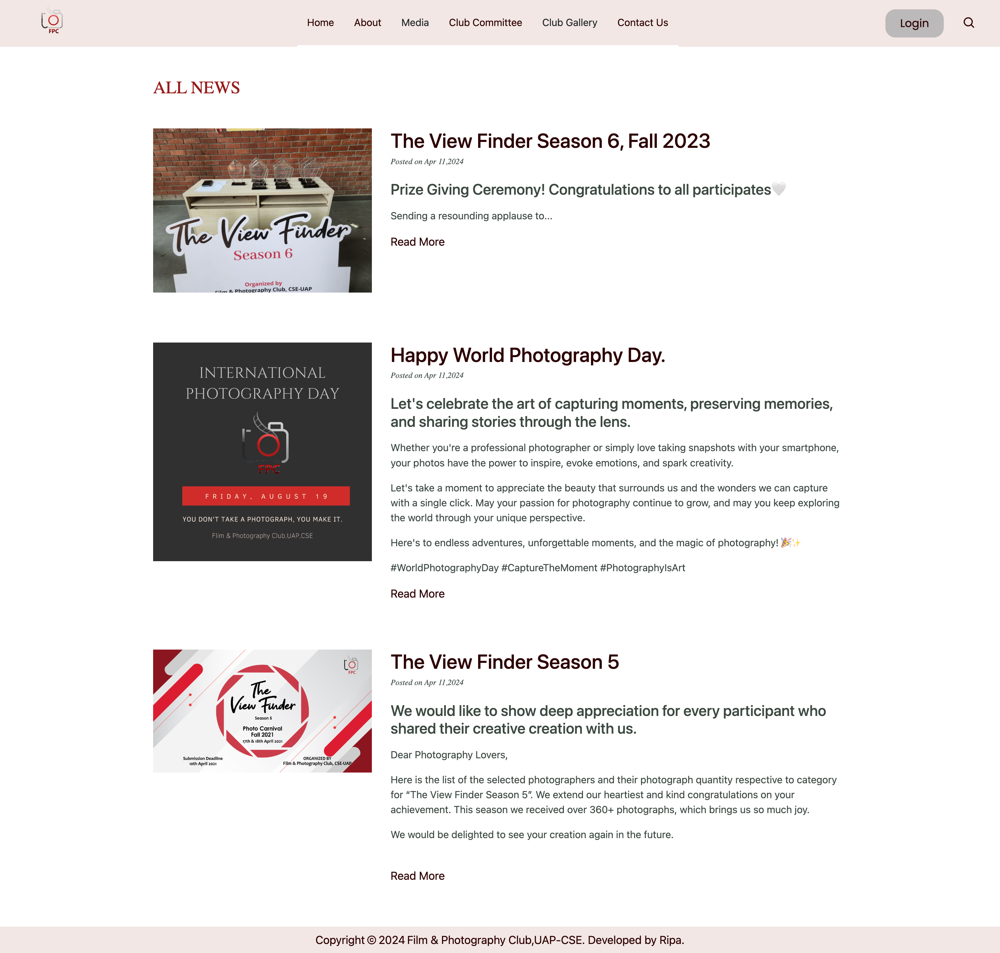

# Film & Photography Club Website

Welcome to the Film & Photography Club website! This project is created using Python Django framework for the backend and HTML, CSS, Bootstrap, and JavaScript for the frontend. The website features various functionalities catered to club members and visitors.

## Features

1. **Home Page**
   - Includes a slider showcasing club activities.
   - Recent events section displays the latest club happenings.

    

3. **About Page**
   - Provides details about the club, its programs and committee designations.

    

4. **Log In Page**
   - Only club committee members can log in using their email and password.

  

    

5. **Media Section**
   - News:
     - Visitors can view a list of news.

   

     - Clicking on a news item displays the full news.
     - Sidebar shows recent news ordered by date.

    

   - Notice:
     - Visitors can view a list of notices.
        
       
     - Clicking on a notice item displays the full notice.
     - Sidebar shows recent notices ordered by date.
          

   - Event:
     - Visitors can view a list of events.
       
       
       
     - Clicking on an event item displays the full event details.
     - Sidebar shows recent events ordered by date.

         

**Club Committee Member (Logged-in users) can create, update, and delete events, news, and notices.**

   - Create:
      

   - Update:
      

   - Delete:
         
       
5. **Club Committee Page**
   - Displays information about club members and their designations.
   - Logged-in club members can edit their information on this page.

      

6. **Contact Us Page**
   - Allows any user to send an email to the club for inquiries and communication.
  
        

## Installation

To run the project locally, follow these steps:

1. Clone this repository.
2. Navigate to the project directory.
3. Install dependencies using `pip install -r requirements.txt`.
4. Run migrations using `python manage.py migrate`.
5. Start the development server with `python manage.py runserver`.
6. Access the website at `http://localhost:8000`.
